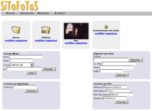
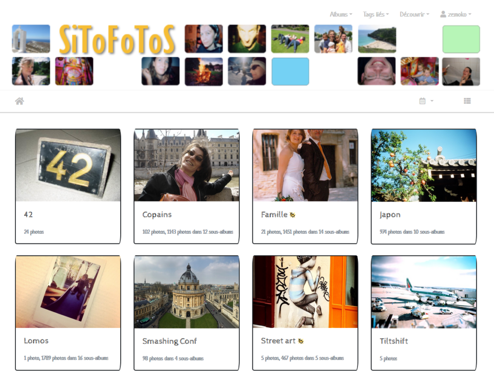

Je continue mon **processus de réappropriation de ma vie numérique** : après avoir repris le contrôle de ma messagerie (bye-bye Gmail), avoir sécurisé l'hébergement de mes sites (coucou Gandi), il était temps de mettre fin à une parenthèse de presque 14 ans pour reprendre la main sur ma photothèque.

## De 1998 à 2005, 3 générations de SiToFoToS

 J'ai créé **l'un de mes premiers sites** pour pouvoir partager mes photos, c'était le **"SiToFoToS (les fotos du moko)"**. Elles étaient rangées par albums, tout le monde pouvait les partager, les commenter.

Le plus compliqué, c'était d'en réduire la qualité, pour en réduire le poids, à une époque où le stockage coutait cher, et où la bande passante obligeait à réduire la qualité, donc le poids, des photos.

## 2005 et l'arrivée de Flickr

En 2005, la donne a changé avec l'arrivée de Flickr : il devenait possible d'**y stocker mes photos simplement, tout en tirant partie de leurs API** pour pouvoir continuer à alimenter le SiToFoToS. L'association des deux me laissait entrevoir un futur radieux.

## Puis ce fut la lutte (épuisante) contre le spam

Le SiToFoToS a continué sa petite vie comme ça pendant quelques années... pendant lesquels **j'ai vu la masse de spams grandir**. J'ai mis en place quelques règles simples, puis de plus en plus compliquées... et **j'ai fini par baisser les bras et par fermer les commentaires. C'était trop compliqué, trop chronophage**.

Et puis... Flickr, c'était si pratique. En plus, depuis que _Yahoo!_ l'avait racheté, je ne m'inquiétait pas trop de sa pérennité (**_Yahoo!_, vous vous rendre compte !**).

## 2018, Flickr est racheté par Smugmug

Depuis, il faut avouer que **_Yahoo!_ a perdu de sa superbe et a fini par vendre Flickr à Smugsmug**.

Moi-même, j'ai perdu peu de contenus (j'ai toujours été prudent, et farouchement réticent aux plateformes trop centralisatrices) mais j'ai vu quelques services disparaitre, et leurs contenus avec/ J'ai aussi pris conscience de **la difficulté à parier sur la pérennité de quelque site que ce soit**.

Flickr existe toujours, certes... mais les offres ont évoluées, et elles me correspondent de moins en moins.

## 2019 : _Yahoo!_ Groupes disparait

Paradoxalement, **c'est l'annonce de la fin de _Yahoo!_ Groupes qui m'a donné envie de récupérer mes photos**. Maintenant. Pour ne pas avoir à le faire dans l'urgence si Flickr devait disparaitre, ou si ses conditions d'utilisation évoluaient une nouvelle fois dans le mauvais sens.

Quelques recherches sur Qwant m'ont rapidement orienté sur **la solution [Piwigo](https://piwigo.org/) : flexible, personnalisable, facilement installable sur mon hébergement**. Mieux : un plugin [Flickr2Piwigo](https://piwigo.org/ext/extension_view.php?eid=612) permet facilement de récupérer tout ses albums et toutes ses photos

## 1er novembre 2019 : SiToFoToS is back

Bref, tout ça pour vous dire que **[le SiToFoToS](https://sitofotos.6x8.org) is back !** :):):)

* * *

PS. Certains albums sont privés et donc réservés aux copains et à la famille, si vous voulez un accès, vous savez où me trouver ;)

PPS. Bon... et maintenant... J'en fais quoi de mes archives _Yahoo!_ Groupes ?
